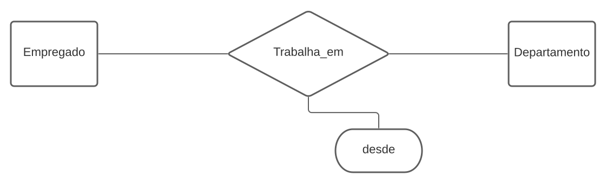

# Base de Dados

## O que é uma base de dados? 

Bases de dados são conjuntos de informação organizada. A informação é tipicamente organaziada para modelar aspector relevantes da realidades (por exemplo a disponibilidade de quartos de hoteis), duma forma que ajuda o processo que requer esta informação (por exemplo encontrar um hotel nas férias).
São operados pelos Sistemas Gerenciadores de Bancos de Dados (SGBD)

## O que é um SGBD? (Database Management System)

Um sistema de gestão de base de dados é um pacote de software com programas de computador que controla, mantêm a manutenção e usam a base de dados. Isto permite organizações a desenvolver convenientemente bases de dados para várias aplicações. 

A base de dados é uma colecção de informação recolhida, ficheiros e outros objectos enquanto o SGBD possui várias funcionalidades que ajudam na gestão do banco de dados (são ferramentas que ajudam na gestão da base de dados, possibilitam o acesso, edição, consulta e inserção de dados). 

Principais SGBDS:
* [MySql](https://www.mysql.com/): O MySQL é um dos SGBDS mais utilizados no mundo todo, é uma tecnologia Open Source.
Uma das características que levam muitas empresas a escolherem o MySQL como SGBD, é que ele é muito simples e é capaz de ser rodado em diferentes sistemas operativos.
* [Oracle Database](https://www.oracle.com/database/): A Oracle é uma das maiores empresas tecnológicas do mundo. Um dos seus principais produtos é o seu SGBD. Ao contrário do MySql, ele não é Open Source.
* [Microsoft SQL Server](https://www.microsoft.com/en-us/sql-server): O SQL Server é o SGBD criado pela Microsoft, foi lançado em 1988 como parte do Windows NT, algum tempo depois ele passou a ser comercializado separado como um único produto.
* [PosgreSQL](https://www.postgresql.org/): O PostgreSQL é um banco de dado relacional Open Source lançado em 1989 e desde então mantém se entre os 5 SGBD mais utilizados do planeta.
* [MongoDB](https://www.mongodb.com/3): MongoDB é um dos SGBD que mais cresceu nos últimos anos. Sendo open source e unindo o melhor dos sistemas relacionais e muitas inovações NoSQL. Esse SGBD possui consultas dinâmicas e também modelos de dados orientados a documentos.

## Modelos de Base de Dados 

É um conjunto regras e métodos que permite representar conjuntos de dados (entidades) especificando as relações entre cada um deles.

* **Modelo baseado em objectos**: Procuram representar a realidade através de objetos;
* **Modelo documental**: Projetado para armazenar e consultar dados como documentos do tipo JSON;
* **Modelo baseado em registos**: Procuram representar a realidade através de registos;
* **Modelo hierárquico**: Muito rígido, estrutura em árvore;
* **Modelo em rede**: Implementação difícil e estrutura em rede;
* **Modelo Entidade relacionamento (E-R)**: Representa a realidade através da entidade, relacionamento entre as várias entidades e atributos que compõem uma entidade.

##Modelo Entidade Associação 

### Entidades 

Objeto do mundo real: 
* com existência física: Estudante, Departamento
* com existência conceptual: Curso, Turma, Tipo de Estudante

### Associações

Representam interacções entre 2 ou mais entidades. 

Exemplo: Carro _**pertence**_ a pessoa.

### Atributos 

Num esquema Entidade - Associação os atributos representam os valores que vão ser armazenados na Base de Dados. 

#### Simples e Compostos

* Simples ou Atómicos: Não são diviseis.
* Compostos: Divisíveis em atributos simples com significados independentes

#### Valor único e Multi-valor

* Valor único: apenas um valor por entidade
* Multi valor: cada entidade por ter mais do que um valor.

Exemplo: Uma pessoa pode ter vários números de telefone.

#### Valores Nulos 

* Alguns atributos permitem valores nulos. Um valor nulo pode significar que o valor não é conhecido ou que não é aplicável. 

#### Atributos Chave

* Atributo, ou conjunto de atributos, que identifica univocamente uma entidade.
* Não podem existir duas entidades do mesmo tipo com o mesmo valor para os seus atributos chave.

Exemplo: 2 carros diferentes não podem ter a mesma matrícula.

### Notação 

#### Entidade 
Caracteriza-se por um nome e uma lista de atributos. 

Exemplo: Empregado (nome, morada, cidade)

* Atributo Chave: Sublinhado 
* Atributo Composto: nome do atributo e lista de subatributos entre parênteses.
* Atributo Multi-valor: entre chavetas

Exemplo: Empregado (_ BI _, nome, morada (rua, numero, andar), cidade, {telefone})

### Associação 

Uma associação relaciona uma ou mais entidades e devem ser usadas sempre que sentimos necessidade de criar um atributo contendo atributos_chave de outra entidade 

Exemplo: Carro pertence a uma pessoa 

* As associações são representados pelo seu nome, a lista de entidades que nela partipam e os seus atributos. 
* Normalmente usa-se um verbo e tenta-se que este faço sentido ao ser lido pela ordem
* Entidade1 -> assosiação -> Entidade 2 

Exemplo: 

    pertence_A(Carro, Pessoa)
    tem (Curso, Alunos) 
    trabalha_em(Empregado, Departamento, desde)

#### Grau ou Aridade

* Unária ou Reflexiva 
  

    supervisiona(Empregado, Empregado)

* Binárias (as mais comuns)

    pertence_A(Carro, pessoa) 

* Ternárias (podem sempre ser transformadas em Binárias)

    forneceu(Produtor, Produto, Projecto)

#### Cardinalidade 

* **N:1 ou 1:N**: muitos para um ou um para muitos
* **1:1**: um para um 
* **N:N**: muitos para muitos 

    
    pertence_A(Carro, Pessoa) N:1
    supervisiona(Empregado, Empregado) 1:1 
    trabalha_Em(Empregado, Projecto) N:N

#### Participação 

* Total: depedência existêncial, espera-se que todas as entidades deste tipo participem na associação (frequente em associação de N:1 do lado do N)
* Parcial: as entidades podem ou não participar na associação 

    partenceA(Carro, Pessoa) N:1 t/p

    Todos os carros na base de dados têm de ter um dono mas nem todas as pessoas têm de ser donas de carros

### Exemplo
    * Uma empresa está dividida em departamentos.
    * Cada departamento tem um nome, um número e um gerente. Deve ser ainda guardada a data em que o gerente começou a gerir o departamento. 
    * Um departamento controla um determinado número de projetos. Cada projeto tem um nome e um número.
    * Para cada empregado, guardar o nome, o número de BI, endereço e salário. 
    * Um empregado pertence a um departamento, mas pode trablhar em vários projectos, que não são necessarimente controlados pelo mesmo departamento. 
    * Tomar nota do número de horas por semana que um empregado trabalha num dado projecto. 
    * Tomar nota do supervisor directo de cada empregado

##Modelo Relacional 

O modelo mais comum, o modelo relacional, classifica dados em tabelas, também conhecidas como relações, cada uma das quais consiste em colunas e linhas. Cada coluna lista um atributo da entidade em questão. 

sid   | name | login | age | gpa
--------- | ------ | ------ | ------ | ------
5000 | Dave | dave@cs | 19 | 3.3 
5366 | Jones | jones@cs | 18 | 3.4 

    Students (sid:string, name: string, login: string, age: string, gpa: real

* Cada coluna é um atributo 
* Cada linha é um tuplo 

### Chave de uma Relação

* Identifica de forma única os tuplos da relação. 
* Conjunto mínimo de atributos da relação tal que não existam 2 tuplos distintos com valores iguais nesses atributos.

#### Chave Candidata 

Atributo ou conjunto de atributos que permitem identificar de forma inequívoca qualquer tuplo dessa
relação. 

De entre as possíveis chaves candidatas é escolhida uma que será
declarada como chave Primária 

#### Chave Primária 
* **Unicidade**: o atributo (ou atributos) da chave primária têm um
valor único para qualquer tuplo da relação.
* **Não nula (Integridade de entidade)**: Não pode haver tuplos da relação que tenham o
  atributo (ou atributos) da chave primária nulos.
* **Não redundante**: Se algum dos atributos que a constituem for
  retirado os restantes deixam de identificar univocamente o
  tuplo. 

| Nome | B.I | N_contribuinte | N_eleitor | Freguesia | Concelho
| ---- | ---- | ---- | ---- | ---- | ----|
| Maria | 1234567 | 123456722 | 2222 | S. Pedro | Covilhã
| Manuel | 3377229 | 234156233 | 3333 |Conceição | Covilhã

    Chaves candidatas: {B.I.}, {N_Contribuinte}, {N_Eleitor, Freguesia, Concelho} 

#### Chave Externa 